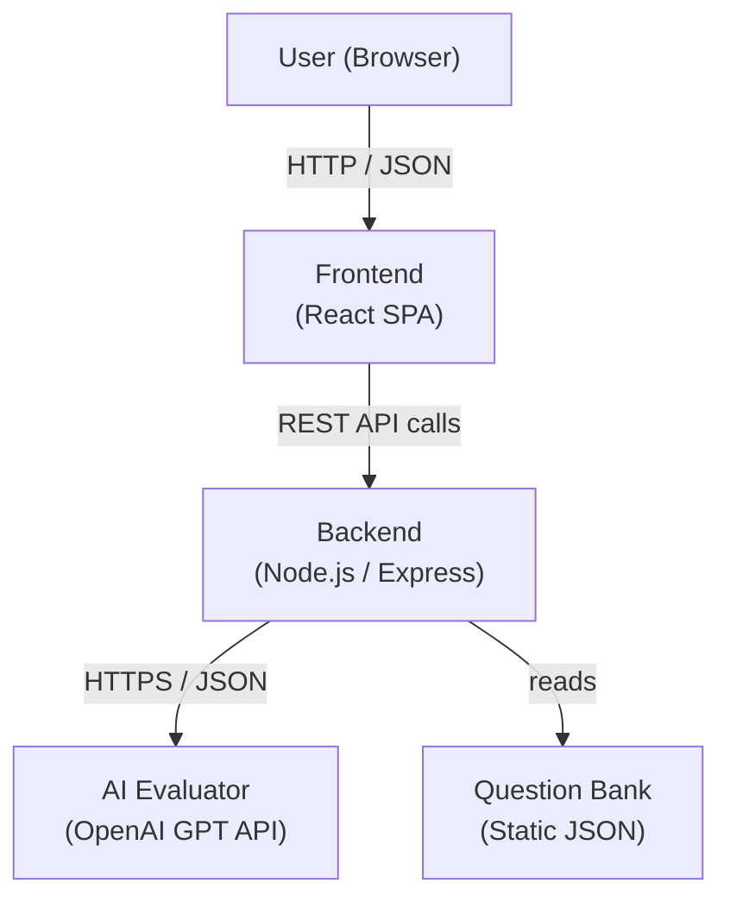

# Design Document: AI InterviewMate

## Overview

AI InterviewMate is a full-stack, AI-powered interview preparation platform consisting of three layers:

1. **Frontend** — A React single-page application providing the user interface for role/difficulty selection, question display, answer submission, feedback display, and session history.
2. **Backend** — A Node.js (Express) REST API that manages question retrieval, orchestrates AI evaluation, and enforces all business rules.
3. **AI Evaluation Layer** — An LLM API integration (OpenAI GPT) called exclusively from the backend to score answers and generate structured feedback.

The platform is designed to be runnable locally with two commands (one per layer) and targets students and fresh graduates who want a frictionless, responsive practice experience.

### Key Design Decisions

- **Stateless Backend with Client-Held Session State**: The session's asked-question tracking (to avoid repetition within a session) is maintained on the client and sent with each request. This keeps the backend stateless, simplifies scaling, and avoids the need for a persistent database for the MVP.
- **Question Bank as Static JSON**: Interview questions are stored as a static JSON file on the backend. This removes any database dependency for the MVP while remaining easy to extend.
- **Structured LLM Prompting**: The backend sends a structured prompt to the LLM and expects a JSON-formatted response (score + strengths + improvements). A strict parse-and-validate step guards against unparseable AI output.
- **React for Frontend**: React is chosen for its component model, which maps naturally to the session/question/history hierarchy, and its rich ecosystem.

---

## Architecture



### Component Responsibilities

| Layer | Responsibility |
|---|---|
| Frontend | UI rendering, client-side validation, session state management, API calls |
| Backend | Request validation, question selection logic, LLM prompt construction, response parsing, error handling |
| Question Bank | Static source of truth for all interview questions |
| AI Evaluator | Score and feedback generation from LLM |

### Request Flows

**Session Start / Question Retrieval**
```
User → Frontend → POST /api/questions → Backend → Question Bank → Response
```

**Answer Evaluation**
```
User → Frontend → POST /api/evaluate → Backend → OpenAI API → Parse → Response
```

---

## Components and Interfaces

### Frontend Components

```
App
├── SelectionScreen
│   ├── JobRoleSelector
│   ├── DifficultySelector
│   └── StartButton
└── SessionScreen
    ├── SessionHeader          (job role + difficulty labels)
    ├── QuestionPanel          (question text display)
    ├── AnswerPanel
    │   ├── AnswerTextArea     (character count, validation)
    │   ├── SubmitButton
    │   └── LoadingIndicator
    ├── EvaluationPanel        (score + feedback sections)
    ├── NextQuestionButton
    ├── NewSessionButton       (triggers confirmation dialog)
    ├── ConfirmationDialog
    └── HistoryPanel
        └── HistoryEntry[]     (collapsible entries)
```

### Backend REST API Endpoints

#### `GET /health`
Returns service status.

**Response 200:**
```json
{ "status": "ok" }
```

---

#### `POST /api/questions`
Retrieves the next question for a role/difficulty, avoiding repetition within the session.

**Request Body:**
```json
{
  "jobRole": "Frontend Developer",
  "difficultyLevel": "Medium",
  "askedQuestionIds": ["q_001", "q_003"]
}
```

| Field | Type | Required | Description |
|---|---|---|---|
| `jobRole` | string | yes | One of the 5 valid job roles |
| `difficultyLevel` | string | yes | One of: Easy, Medium, Hard |
| `askedQuestionIds` | string[] | yes | IDs of questions already shown in this session |

**Response 200:**
```json
{
  "id": "q_007",
  "question": "Explain the difference between == and === in JavaScript.",
  "jobRole": "Frontend Developer",
  "difficultyLevel": "Medium",
  "repeated": false
}
```

**Error Responses:**
- `400` — missing/invalid `jobRole` or `difficultyLevel`

---

#### `POST /api/evaluate`
Submits an answer for AI evaluation.

**Request Body:**
```json
{
  "question": "Explain the difference between == and === in JavaScript.",
  "answer": "The == operator does type coercion...",
  "jobRole": "Frontend Developer",
  "difficultyLevel": "Medium"
}
```

| Field | Type | Required | Description |
|---|---|---|---|
| `question` | string | yes | The question text |
| `answer` | string | yes | The user's answer (1–2000 chars) |
| `jobRole` | string | yes | Context for evaluation |
| `difficultyLevel` | string | yes | Context for evaluation |

**Response 200:**
```json
{
  "score": 7,
  "feedback": {
    "strengths": ["Correctly identified that === checks type and value"],
    "improvements": ["Did not mention implicit type coercion examples"]
  }
}
```

**Error Responses:**
- `400` — empty/whitespace answer or missing fields
- `502` — LLM response could not be parsed into valid score+feedback
- `504` — LLM API timed out (> 10 seconds)
- `500` — unhandled internal error

---

### Backend Internal Modules

```
backend/
├── server.js              Entry point, Express app setup
├── routes/
│   ├── health.js          GET /health
│   ├── questions.js       POST /api/questions
│   └── evaluate.js        POST /api/evaluate
├── services/
│   ├── questionService.js Question selection logic
│   └── evaluationService.js LLM call + response parsing
├── middleware/
│   └── errorHandler.js    Global error handler (no stack traces)
└── data/
    └── questions.json     Static question bank
```

---

## Data Models

### Question (stored in `questions.json`)

```json
{
  "id": "q_001",
  "jobRole": "Frontend Developer",
  "difficultyLevel": "Easy",
  "text": "What is the difference between HTML and HTML5?"
}
```

| Field | Type | Description |
|---|---|---|
| `id` | string | Unique question identifier |
| `jobRole` | string | Associated job role |
| `difficultyLevel` | string | Easy / Medium / Hard |
| `text` | string | The question text |

The question bank ships with at least 5 questions per role/difficulty combination (75 questions minimum across 5 roles × 3 levels), providing a meaningful non-repeating session experience.

### Valid Job Roles (enum)

```
"Java Developer"
"Software Developer"
"Frontend Developer"
"Backend Developer"
"Full Stack Developer"
```

### Valid Difficulty Levels (enum)

```
"Easy"
"Medium"
"Hard"
```

### Evaluation Request (sent to LLM)

The backend constructs a structured prompt:

```
You are an expert technical interviewer evaluating a candidate's answer.

Job Role: {jobRole}
Difficulty: {difficultyLevel}
Question: {question}
Candidate Answer: {answer}

Respond ONLY with valid JSON in this exact format:
{
  "score": <integer 0-10>,
  "strengths": ["<strength 1>", ...],
  "improvements": ["<improvement 1>", ...]
}

Rules:
- score must be an integer between 0 and 10 inclusive
- strengths must contain at least one item
- improvements must contain at least one item
- Do not include any text outside the JSON object
```

### Evaluation Response (parsed from LLM)

```typescript
interface EvaluationResult {
  score: number;          // integer 0–10
  feedback: {
    strengths: string[];    // at least 1 item
    improvements: string[]; // at least 1 item
  };
}
```

### Session State (held in Frontend memory / React state)

```typescript
interface SessionState {
  jobRole: string;
  difficultyLevel: string;
  currentQuestion: Question | null;
  currentAnswer: string;
  evaluationResult: EvaluationResult | null;
  askedQuestionIds: string[];
  history: HistoryEntry[];
  view: "selection" | "question";
}

interface HistoryEntry {
  question: string;
  answer: string;
  score: number;
  feedback: {
    strengths: string[];
    improvements: string[];
  };
  timestamp: number;
}
```

---

## Error Handling

### Backend Error Handling Strategy

All errors follow a consistent JSON envelope:

```json
{ "error": "<human-readable message>" }
```

Stack traces are never included in responses. The global error handler middleware catches unhandled errors and returns HTTP 500.

| Scenario | HTTP Status | Error Message |
|---|---|---|
| Missing/invalid request field | 400 | `"<field> is required"` or `"<field> must be one of ..."` |
| Empty/whitespace answer | 400 | `"answer field is required and cannot be empty"` |
| Question not found | 404 | `"No questions found for the given role and difficulty"` |
| LLM parse failure | 502 | `"Evaluation service returned an unparseable response"` |
| LLM timeout (> 10s) | 504 | `"Evaluation service timed out"` |
| Unhandled internal error | 500 | `"Internal server error"` |

### Frontend Error Handling Strategy

| Scenario | User-Facing Behavior |
|---|---|
| Empty answer submission | Inline validation message below textarea |
| Character limit reached | Inline warning + input blocked |
| Evaluation API failure | Error message shown; submit button re-enabled |
| Evaluation timeout (30s) | Error message shown; submit button re-enabled |
| Next question API failure | Error message shown; user can retry |
| New session confirmation cancelled | Dialog dismissed; session intact |

---

## Testing Strategy

### Unit Tests

Unit tests cover backend business logic with concrete, deterministic inputs:

- **Question selection logic**: given a list of asked IDs and a question bank, correct next question is returned; `repeated: true` is set when all are exhausted.
- **Input validation**: each endpoint returns 400 for missing/invalid fields.
- **LLM response parsing**: valid JSON is parsed correctly; invalid JSON triggers 502 path.
- **Answer validation**: whitespace-only answers are rejected with 400.
- **Health endpoint**: returns `{ "status": "ok" }`.

### Property-Based Tests

Property-based tests use a PBT library (fast-check for Node.js) to verify universal behavioral properties across randomly generated inputs. Each test runs a minimum of 100 iterations. See Correctness Properties section for the full list.

### Integration Tests

- End-to-end flow with a mocked LLM API: selection → question retrieval → answer submission → evaluation results displayed.
- Error path coverage: LLM timeout simulation, unparseable LLM response simulation.

### Frontend Tests

- Component rendering tests (React Testing Library): selection screen, answer panel character count, evaluation display format.
- User interaction tests: confirm button disabled until both fields selected, "Next Question" clears previous state.

*A property is a characteristic or behavior that should hold true across all valid executions of a system — essentially, a formal statement about what the system should do. Properties serve as the bridge between human-readable specifications and machine-verifiable correctness guarantees. Property-based tests use **fast-check** (Node.js) and run a minimum of 100 iterations each.*


---

## Correctness Properties

### Property 1: Session Header Always Shows Active Role and Difficulty

*For any* valid combination of `jobRole` and `difficultyLevel`, once a session is started, the interface header must display both values as visible text labels on every view within that session.

**Validates: Requirements 1.5**

---

### Property 2: Question Retrieval Matches Requested Role and Difficulty

*For any* valid `jobRole` and `difficultyLevel`, every question returned by the question selection function must have its `jobRole` and `difficultyLevel` fields equal to the requested values — on first retrieval and on all subsequent retrievals within the same session.

**Validates: Requirements 2.1, 2.2**

---

### Property 3: Question Retrieval Avoids Previously Asked Questions

*For any* `jobRole`, `difficultyLevel`, and set of `askedQuestionIds` where at least one unasked question exists for that combination, the returned question's `id` must not be present in `askedQuestionIds`.

**Validates: Requirements 2.3**

---

### Property 4: Exhausted Question Bank Signals Repetition

*For any* `jobRole` and `difficultyLevel` where `askedQuestionIds` contains all available question IDs for that combination, the response must include `repeated: true`.

**Validates: Requirements 2.4**

---

### Property 5: Answer Character Limit Enforcement

*For any* string of length between 1 and 2000 (inclusive), the answer text area must accept the input. For strings exceeding 2000 characters, further input must be blocked and a warning displayed.

**Validates: Requirements 3.2, 3.4**

---

### Property 6: Character Count Display Accuracy

*For any* string typed into the answer input area (up to the 2000-character limit), the displayed character count must equal the exact length of the typed string.

**Validates: Requirements 3.8**

---

### Property 7: Evaluation Response Parse Validity

*For any* valid JSON response from the AI Evaluator, the backend's parse-and-validate step must produce an `EvaluationResult` where `score` is an integer satisfying `0 ≤ score ≤ 10`, `feedback.strengths` contains at least one item, and `feedback.improvements` contains at least one item.

**Validates: Requirements 4.2, 4.3, 4.4**

---

### Property 8: Unparseable Evaluator Response Produces 502

*For any* string returned by the AI Evaluator that cannot be parsed into a valid `EvaluationResult` (missing fields, out-of-range score, empty strengths/improvements arrays, or non-JSON text), the backend must respond with HTTP 502.

**Validates: Requirements 4.5**

---

### Property 9: Evaluation Results Display Format

*For any* `EvaluationResult` with a score in `[0, 10]` and non-empty strengths and improvements arrays, the rendered evaluation panel must display the score in the exact format `"{score} / 10"` and include both a "Strengths" labeled section and an "Areas for Improvement" labeled section.

**Validates: Requirements 4.7, 4.8**

---

### Property 10: Whitespace-Only Answer Rejected with HTTP 400

*For any* string composed entirely of whitespace characters (including the empty string, spaces, tabs, and newlines), submitting it as the `answer` field to the evaluation endpoint must return HTTP 400 with a JSON body containing an `error` field.

**Validates: Requirements 4.9**

---

### Property 11: Next Question Clears Answer Field

*For any* non-empty string currently in the answer input field, clicking the "Next Question" button must result in the answer input field containing an empty string.

**Validates: Requirements 5.2**

---

### Property 12: Next Question API Call Uses Current Session Parameters

*For any* active session with a given `jobRole` and `difficultyLevel`, clicking "Next Question" must trigger an API call to the question endpoint with those exact `jobRole` and `difficultyLevel` values.

**Validates: Requirements 5.4, 5.5**

---

### Property 13: Session History Ordering and Completeness

*For any* sequence of evaluation results completed during a session, the Session History panel must contain all entries in reverse chronological order (most recent first), and each new evaluation result must appear as the first entry immediately after completion — without a page reload.

**Validates: Requirements 6.1, 6.2, 6.4**

---

### Property 14: History Entry Displays All Required Fields

*For any* `HistoryEntry`, the rendered history entry must visibly include the question text, the user's answer, the score in `"X / 10"` format, and the feedback (strengths and improvements).

**Validates: Requirements 6.3**

---

### Property 15: New Session Clears All Session State

*For any* non-empty session state (any question, answer, evaluation result, and history), confirming "Start New Session" must result in completely cleared state: empty history, no current question, no current answer, and navigation to the selection interface.

**Validates: Requirements 6.6, 7.3**

---

### Property 16: Cancelling New Session Preserves All Session State

*For any* session state, cancelling the "Start New Session" confirmation dialog must leave every field of the session state unchanged — including the current question, current answer, evaluation result, and all history entries.

**Validates: Requirements 7.4**

---

### Property 17: Invalid Request Payload Returns HTTP 400 with Error Field

*For any* request to a backend endpoint that is missing a required field or contains an invalid field value, the backend must return HTTP 400 with a JSON body containing a non-empty `error` field identifying the problematic field(s).

**Validates: Requirements 8.5**

---

### Property 18: Unhandled Internal Error Returns HTTP 500 Without Stack Trace

*For any* unhandled error thrown within a backend route handler, the error handling middleware must return HTTP 500 with a JSON body `{ "error": "<non-empty message>" }` that does not include a `stack` field or any stack trace text.

**Validates: Requirements 8.10**
